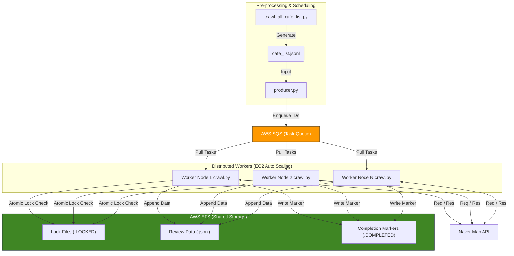

# Distributed Naver Map Review Crawler


## 📖 Project Overview

이 프로젝트는 **카페 리뷰 기반 측면 감성 분석 모델(Aspect-based Sentiment Analysis)** 학습을 위한 대규모 데이터셋 구축을 위해 설계되었습니다.

단일 머신에서의 크롤링 한계를 극복하기 위해 **AWS SQS(Simple Queue Service)와 EFS(Elastic File System)를** 활용한 **분산 크롤링 아키텍처**를 구현했습니다. 이를 통해 수집 속도와 데이터 무결성을 획기적으로 개선했습니다.

### 🚀 Performance Improvement
> **"단일 로컬 환경 대비 약 6~8배 성능 향상"**

기존 단일 프로세스 실행 시 **24시간 이상** 소요되던 대규모 리뷰 데이터 수집 작업을, **5~8대의 EC2 인스턴스(t2.micro/small) 분산 처리**를 통해 **3~4시간** 내로 단축시켰습니다.

---

## 🏗 System Architecture

AWS 클라우드 환경에서 Producer-Consumer 패턴을 적용하여, 작업의 분배와 데이터 저장을 분리했습니다.


---
## ⚙️ Key Engineering Decisions

### 1. Concurrency Control with File-based Locking
다수의 EC2 워커가 공유 스토리지(EFS)의 동일한 파일에 접근할 때 발생할 수 있는 Race Condition을 방지하기 위해 엄격한 동시성 제어 로직을 구현했습니다.
* **Atomic Locking:** `os.open(path, os.O_CREAT | os.O_EXCL)` 플래그를 사용하여 운영체제 레벨에서 원자적(Atomic)으로 락 파일을 생성합니다.
* **Deadlock Prevention:** 워커가 비정상 종료되어 락 파일이 남을 경우를 대비하여, `LOCK_TIMEOUT_SECONDS(1200초)`가 지난 락 파일은 후속 워커가 강제로 점유할 수 있도록 하여 데드락을 방지했습니다.

### 2. Fault Tolerance & Data Integrity (결함 내성 및 무결성)
분산 환경 및 네트워크 불안정 상황에서도 데이터의 손실과 중복을 막기 위한 전략입니다.
* **Resume Capability (이어하기):**
    * 대용량 JSONL 파일을 효율적으로 읽기 위해 파일 포인터를 끝으로 이동(`seek(0, os.SEEK_END)`)시킨 후 역순으로 읽어 마지막 `cursor`를 추출합니다. 이를 통해 중단된 지점부터 즉시 수집을 재개합니다.
* **Idempotency (멱등성 보장):** 작업 완료 시 `.COMPLETED` 마커 파일을 생성합니다. 워커는 작업을 시작하기 전 마커를 확인하여 이미 완료된 작업을 즉시 스킵(Skip)합니다.
* **Graceful Shutdown:** SQS의 `ApproximateNumberOfMessagesNotVisible`(처리 중인 메시지) 수가 0이 될 때까지 대기 후 종료함으로써, 모든 노드의 작업이 안전하게 끝난 것을 확인하고 인스턴스를 종료합니다.

### 3. Anti-Blocking Strategy (차단 회피)
네이버 지도 API의 강도 높은 봇 탐지 정책을 우회하기 위한 전략입니다.
* **Hybrid Request Method (Browser Context + API):** 초기 진입은 `Playwright Browser`를 통해 봇 탐지를 우회하고 쿠키를 확보합니다. 이후 데이터 페이징은 브라우저 컨텍스트를 공유하는 **`Playwright APIRequestContext`를** 사용하여, 렌더링 오버헤드 없이 고속으로 JSON 데이터만 수집합니다.
* **Adaptive Backoff:** 429 (Too Many Requests) 응답 시 헤더의 `Retry-After` 값을 파싱하여 정확한 시간만큼 대기하거나, 랜덤 지터(Random Jitter)를 적용하여 패턴 분석을 회피했습니다.

---

## 📂 Project Structure

```bash
├── crawl_all_cafe_list.py     # [Step 1] 네이버 지도 검색 결과로 카페 리스트 수집 (jsonl)
├── crawl_cafe_basic_info.py   # [Step 2] 로컬 리스트 기반 상세 정보 추출 (Multi-threading)
├── producer.py                # [Step 3] 수집 대상 카페 ID를 AWS SQS로 전송
└── crawl.py                   # [Step 4] SQS Consumer & Core Crawler (EC2 배포용)
```
* **`crawl_all_cafe_list.py`**: 검색어 기반으로 카페 리스트를 확장 가능한 JSONL 포맷으로 저장.
* **`crawl_cafe_basic_info.py`**: I/O Bound 작업임을 고려하여 멀티 스레딩(5 threads)을 적용, 빠르게 기본 메타데이터(위치, 영업시간 등)를 수집. 데이터 정합성을 위해 JSON(All-or-Nothing) 방식으로 저장.
* **`crawl.py`**: 핵심 크롤러. SQS로부터 메시지를 받아 EFS에 리뷰 데이터를 JSONL(Append-only) 방식으로 저장. Playwright Browser(인증/세션)와 APIRequestContext(고속 데이터 페칭)를 결합한 하이브리드 방식 사용.

---

## 🛠 Usage & Setup

### Prerequisites
* Python 3.10+
* AWS Credential (SQS, EFS access required)
* Playwright Browsers (`playwright install chromium`)

### 1. Cafe List Collection & Enqueue
로컬 또는 마스터 노드에서 대상을 수집하고 큐에 작업을 등록합니다.
```bash
# 1. 카페 리스트 검색
python crawl_all_cafe_list.py

# 2. 기본 정보 수집 (선택)
python crawl_cafe_basic_info.py

# 3. AWS SQS에 작업 등록
python producer.py
```
### 2. Distributed Crawling (Worker Nodes)
각 EC2 워커 노드(Linux 환경)에서 batch.txt에 정의된 스크립트를 실행합니다. (EFS 마운트 및 실행 명령어 포함)

---

## 📝 Troubleshooting Log

* **Issue:** 대용량 JSONL 파일을 매번 처음부터 읽어 커서를 찾는 과정에서 오버헤드 발생.
    * **Solved:** `seek()`을 활용한 역순 읽기 알고리즘을 구현하여 파일 크기와 무관하게 O(1)에 가까운 속도로 마지막 커서 획득.
* **Issue:** 네트워크 지연으로 인해 특정 워커가 락을 잡은 채로 좀비 프로세스가 되는 현상.
    * **Solved:** Lock 파일에 타임스탬프를 기록하고, 후속 워커가 `LOCK_TIMEOUT`을 검사하여 락을 탈취(Steal)할 수 있도록 자가 치유(Self-healing) 로직 추가.